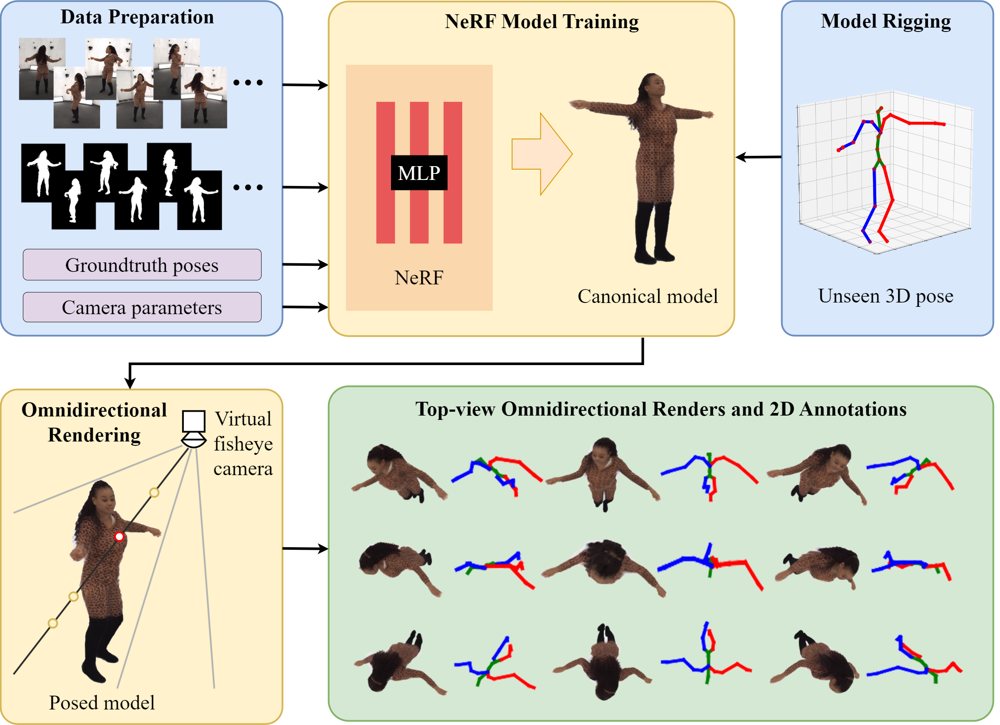

# NToP: a large-scale top-view fisheye HPE dataset

**Make use of existing high quality Mocap/HPE datasets and generate new datasets with NeRF. No new recordings necessary.**


[[Paper](https://arxiv.org/abs/2402.18196)]
[[Datasets](https://www.tu-chemnitz.de/etit/dst/forschung/comp_vision/datasets/index.php.en)]
[[ViT-Pose weights](https://tuc.cloud/index.php/s/JY66NkmTAqAdeKR)]

This repository is the implementation of NToP (ECCV 2024 Workshop SyntheticData4CV).

Due to License limitations, we are not able to release most part of the dataset.
Therefore, this repo enables potential users to train and render their own dataset.



## Train and render Human3.6M and Genebody datasets

### Set up working environment
You need to set up two environments, one for [EasyMocap](https://chingswy.github.io/easymocap-public-doc/install/install.html) and one for [HumanNeRF](https://chingswy.github.io/easymocap-public-doc/install/install.html). It also works by creating one env for Humannerf and installing the extra requirements of EasyMocap in the same env.

### Download and pre-process datasets

For Human3.6M and Genebody dataset, you need to download and process the datasets, because their licenses don't allow the distribution of derived data.

Download Human3.6M dataset [here](http://vision.imar.ro/human3.6m/description.php) and Genebody [here](https://github.com/generalizable-neural-performer/gnr/blob/main/docs/Dataset.md), and pre-process them by the [instructions](./Easymocap/Readme.md).
There is the extra step for Human3.6M to generate masks for the human objects. According to [this issue in Neuralbody](https://github.com/zju3dv/neuralbody/issues/27), the original mask quality is not good enough. We recommend using background subtraction. You can also try [SAM 2](https://github.com/facebookresearch/sam2), which was not yet released at the time of our implementation, and SAM could not provide good enough masks.
After pre-processing, the data need to be prepared for humannerf.

For Human3.6M, taking subject "S1" and action "Posing" as an example,
```bash
cd /path/to/NToP/humannerf/tools/prepare_h36m_multiview/
python prepare_dataset.py --cfg ./S1.yaml 
```

For Genebody, taking subject "barry" as an example,
```bash
cd /path/to/NToP/humannerf/tools/prepare_genebody/
python prepare_dataset.py --cfg ./barry.yaml 
```

If you need the **ntopZJU** dataset, you can directly download it [here](https://www.tu-chemnitz.de/etit/dst/forschung/comp_vision/datasets/ntop/index.php.en). If you want to try training and rendering with ZJU-Mocap, you can follow the [instructions in Humannerf](https://www.tu-chemnitz.de/etit/dst/forschung/comp_vision/datasets/ntop/index.php.en) to prepare it.

### Train models
Place the prepared data in `NToP/humannerf/dataset/`. The file structure should look like this:
```bash
NToP
├── humannerf
    ├── dataset
        ├── genebody
            ├── barry
                ├── images
                ├── masks
                ├── cameras.pkl
                ├── canonical_joints.pkl
                └── mesh_infos.pkl
        ├── h36m_multiview
            ├── S1
                ├── images
                ├── masks
                ├── cameras.pkl
                ├── canonical_joints.pkl
                └── mesh_infos.pkl
        ├── zjumocap
```
To train Barry of Genebody dataset:
```bash
cd /path/to/NToP/humannerf/
python train.py --cfg configs/human_nerf/genebody/barry/adventure.yaml 
```
To train S1 of Human3.6M dataset:
```bash
cd /path/to/NToP/humannerf/
python train.py --cfg configs/human_nerf/h36m/S1/adventure_multiview.yaml 
```
The parameters in `adventure.yaml` are suitable for a single NVidia RTX TITAN 24GB GPU. You can adjust them to your hardware.
The training logs and model weights are saved in `experiments` directory.

### Render
Use the scripts in `NToP/humannerf/scripts/` to bulk render whole datasets, 
for example:
```bash
cd /path/to/NToP/humannerf/
bash ./scripts/genebody_render.sh
```
Or you can use the command in the scripts to render single subjects, for example:
```bash
cd /path/to/NToP/humannerf/
python bulkrender_genebody.py --cfg ./config/human_nerf/genebody/barry/single_gpu_1.yaml
```
Modify the config files in `NToP/humannerf/configs` to generate different views.

For Human3.6M, you need to pre-process for the whole dataset with all actions, so that the SMPL mesh is availabel. You don't need to generate segmentation masks, though. The rest is the same as Genebody.

### Concatenate the dataset and generate 2D annotations
After rendering, move the rendered files to a single folder, in which it should look like this:
```bash
rendered_dataset
    ├── genebody
        ├── {subject1}
            ├── topview_000000
            ├── topview_000001
            └── ...
        ├── ...
    ├── h36m_multiview
        ├── {subject1}
            ├── {action1}
                ├── topview_000000
                ├── topview_000001
                └── ...
            ├── {action2}
            ├── ...
        ├── {subject2}
        ├── ...
    ├── zjumocap
```
Use `NToP/humannerf/ntop_utils/file_rename_concate.ipynb` to concatenate the files, so that each `{subject}` directory contains all the renders of this subject.
The files are named after the naming convention described in `convert_ntop_mmpose.ipynb`.
Now the required annotations in COCO and HybrIK format can be generated with this notebook.
Using the `Z. Final dataset concatenation` part in this notebook the dataset can be devided as described in the paper.

## Pre-trained weights
The ViTPose-B model finetuned on NToP-train and config file is available [here](https://tuc.cloud/index.php/s/JY66NkmTAqAdeKR). It can be directly used with [ViTPose](https://github.com/ViTAE-Transformer/ViTPose).

## Citation
```BibTex
@misc{yu2024ntopdataset,
      title={NToP: NeRF-Powered Large-scale Dataset Generation for 2D and 3D Human Pose Estimation in Top-View Fisheye Images}, 
      author={Jingrui Yu and Dipankar Nandi and Roman Seidel and Gangolf Hirtz},
      year={2024},
      eprint={2402.18196},
      archivePrefix={arXiv},
      primaryClass={cs.CV},
      url={https://arxiv.org/abs/2402.18196}, 
}
```